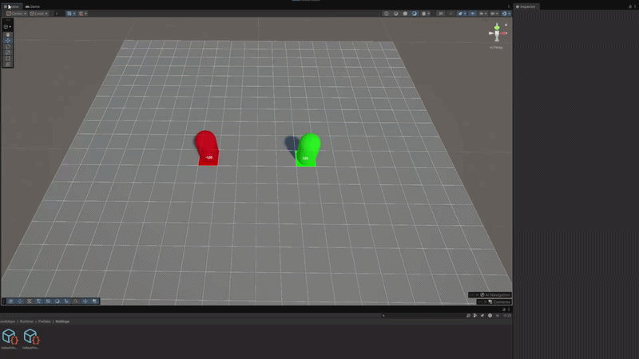
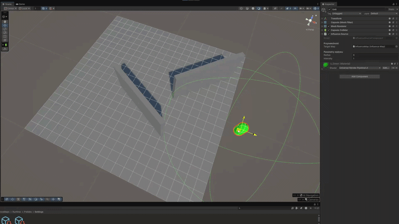
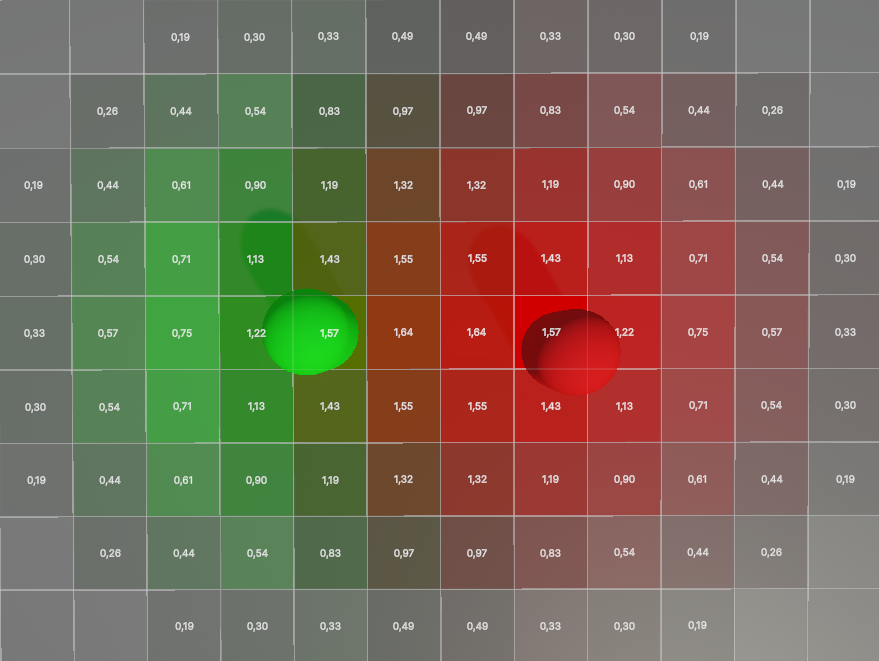
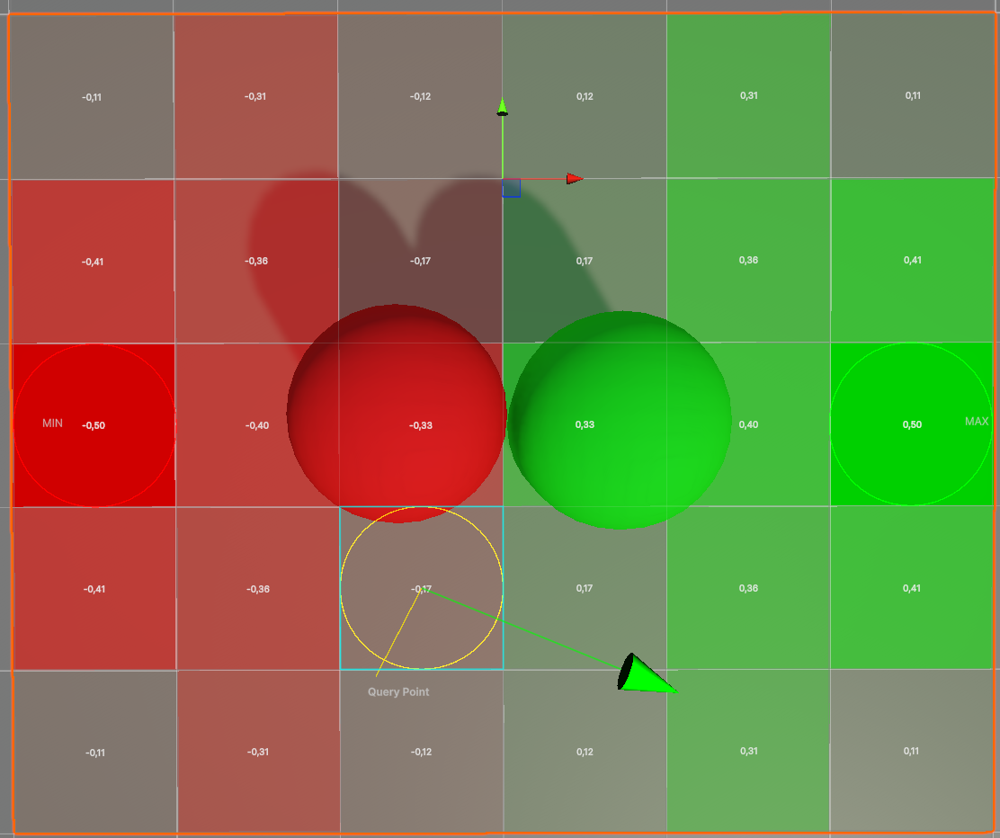
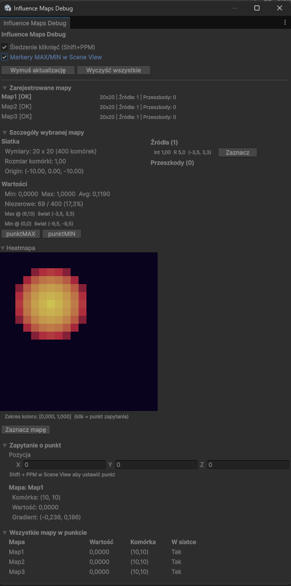

# 🤖 Modular Influence Maps Package for Unity

A high-performance, zero-allocation spatial analysis and tactical AI package for Unity. Features momentum-based wave propagation, dynamic directional obstacle occlusion, custom AnimationCurve-driven falloff profiles, and comprehensive in-editor debugging tools.

Developed as an M.Sc. Eng. Thesis project at Rzeszow University of Technology (Implemented in Unity 6 / .NET Standard 2.1).

---

## 🎥 Visual Demo & Media

|                   _Visualization in scene view_                   |                        _Query point, extremum markers & vector of the fastest increase in value_                         |                  _Dedicated debug window_                   |
| :---------------------------------------------------------------: | :----------------------------------------------------------------------------------------------------------------------: | :---------------------------------------------------------: |
|  |  |  |

---

## ⚡ Key Architectural Features

- Zero GC Allocation in Main Loop: Fixed-update cycle operates without runtime heap allocations, utilizing 1D flattened arrays and double buffering (readBuffer / writeBuffer) for optimal CPU cache utilization.
- Sparse Active Cell Tracking (TrackedCells): Replaces full-grid sweeps by processing only cells with active influence (SwapRemoveAt). Performance scales with active area rather than total map dimensions.
- Wavefront Propagation with Spatial Inertia (WavePipeline): Multi-source incremental wave propagation engine maintaining per-source state across frames (newValue = decayedState + p_total).
- Directional Obstacle Occlusion & BFS Validation: Two-phase collision testing combining 2D AABB fast-rejection with local-space OBB testing. Automated BFS sweep validates topological reachability when barriers sever active wavefronts.
- Modular Pipeline Architecture (IInfluenceMapPipeline): Completely decoupled execution logic. The default WavePipeline can be swapped for custom algorithms or multi-threaded jobs (IJobsInfluenceMapPipeline).
- Cascading Configuration & AnimationCurve Strategies: Two-tiered global/local settings using ScriptableObjects. Propagation and decay curves are visually modeled via native AnimationCurves.
- Multi-Layer Working Maps (WorkingMap & MapCombiner): Supports algebraic operations (Sum, Difference, Multiply, Min/Max, Normalization, Weighted Blends) across multiple independent influence layers.
- Dedicated In-Editor Debugging Suite: Custom EditorWindow (InfluenceMapDebugWindow) featuring live pixel heatmaps, Shift+RMB cell inspection, min/max extremum markers, and steepest-ascent gradient vectors.

---

## 🏗️ Project Structure

Designed in compliance with the official Unity Package Manager (UPM) layout:

InfluenceMaps/
├── Editor/
│ └── InfluenceMapDebugWindow.cs # Custom diagnostic EditorWindow tool
├── Runtime/
│ ├── Components/ # Scene bridge components (Sources, Obstacles)
│ ├── Core/ # Core runtime engine (Grid, Map, Manager, WavePipeline)
│ ├── Data/ # Enums & data definitions
│ ├── Interfaces/ # System contracts (IInfluenceMapPipeline, IDecayFunction, etc.)
│ ├── Query/ # MapCombiner, WorkingMap, and spatial queries
│ ├── Settings/ # Serializable configurations (Grid, Decay, Propagation)
│ ├── Strategies/ # AnimationCurve strategy implementations
│ ├── Utilities/ # Constants and UpdateScheduler
│ └── Visualization/ # Gizmo drawers, MeshRenderer visualizers, Layer configs
└── Samples/ # Demo scenes showcasing AI, obstacles, and multi-map setups

---

## 🛠️ Tech Stack & Compatibility

- Engine: Unity 6.3 LTS (6000.3.8f1)
- Language / Runtime: C# (.NET Standard 2.1)
- Scripting Backends: Mono & IL2CPP compatible
- Render Pipeline: Universal Render Pipeline (URP) & Built-in

---

## 🚀 Getting Started

Follow these steps to configure the Influence Maps system in a brand-new scene:

### Step 1: Environment Setup

1. Create a 3D object, such as a **3D Plane**, to act as your walkable floor (Ground).
2. For moving AI agents, ensure your ground and obstacles are marked as **Navigation Static**, then bake the navigation mesh (**NavMesh**) via _Window > AI > Navigation_.

### Step 2: Manager, Map, and Configuration

1. Create an empty GameObject in the hierarchy and name it `InfluenceMapManager`. Attach the `InfluenceMapManager` script to it.
2. Create your global configuration, propagation, and decay assets by right-clicking in the Project window: **Create > InfluenceMaps > [Select Asset Type]**.
3. Assign the newly created **Global Configuration** asset to the `InfluenceMapManager` component. Within that configuration asset, assign your specific **Propagation** and **Decay** curves.
4. Create another empty GameObject and name it `ThreatMap` (or any layer name you prefer). Attach the `InfluenceMap` script to it.
5. **Positioning & Grid Alignment:** In the `InfluenceMap` component, drag your ground object into the positioning slot. Then, in the Global Configuration settings, set the **Origin Mode** to **Anchor Object**.
6. Customize the grid bounds, cell resolution, and update frequency settings to fit your project's performance and gameplay needs.

### Step 3: Influence Sources & Obstacles

- **Influence Sources:** Attach the `InfluenceSource` to any GameObject (e.g., a tower, item, or enemy). Set its base influence value (positive for allies/rewards, negative for enemies/hazards) and define its **Maximum Influence Range**.
- **Influence Obstacles:** Attach the `InfluenceObstacle` to any blocking geometry. Within the script inspector, specify which map layers this obstacle should affect. Then, fine-tune the **Blocking Strength** and the **Dead Zone** (an area behind the obstacle where influence is forced to 0).

Multiple corresponding scripts with different parameters can be attached to a single source or obstacle depending on the specific map layers they are assigned to.

### Step 4: Configuring the Visualizer

1. Create an empty GameObject named `InfluenceVisualizer` and attach your visualization script.
2. In the **Layers** list inside the inspector, add the specific map layers you want to render.
   _Note:_ Cell value displays and grid lines rendering can be toggled on/off globally inside your **Global Configuration** asset.

---

## 👨‍💻 Academic Context & Authorship

- Author: Arkadiusz Przywara
- Thesis Title: The application of influence maps in the Unity engine
- Degree: Master of Science in Engineering (M.Sc. Eng.) in Computer Science
- Institution: Rzeszow University of Technology
- Faculty: Faculty of Electrical and Computer Engineering
- License: MIT License
